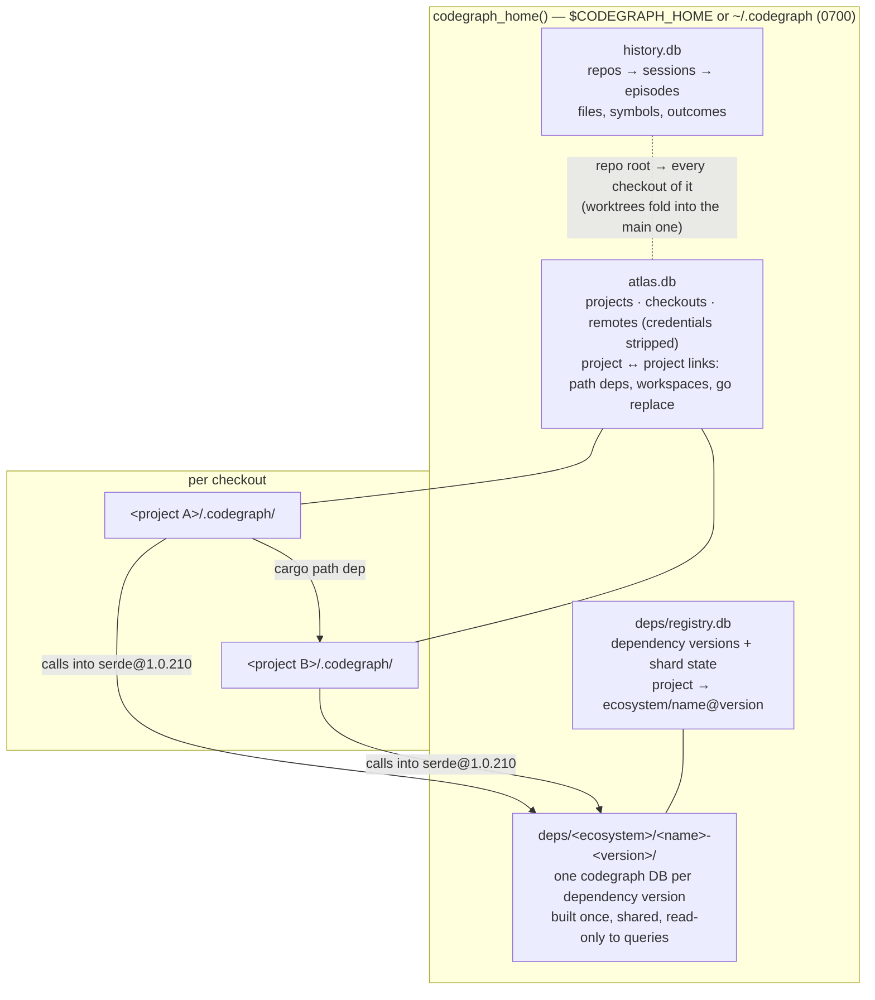

# Federated graph: projects, checkouts and dependencies

One code graph across every project on the machine and the dependencies they
pin — without one monolithic database.

## Why federated, not one global DB

- **Write isolation.** SQLite has one writer per database. Per-checkout
  indexes let every file watcher and `codegraph sync` write independently; a
  single global DB would queue them all behind one lock — the class of stall
  that made the prompt hook time out.
- **Lazy migrations.** A schema or extractor bump upgrades each index on its
  next sync. One database would have to migrate everything (80 GB across 272
  indexes on the development machine) at once.
- **Checkout semantics.** Worktrees and clones of one repo hold different
  code; each checkout keeps its own index (`src/directory.rs` checkout rules).
- **Shared where sharing is real.** Dependency versions *are* identical across
  projects (3,628 crate sources in one cargo registry here), so they are
  indexed once and shared. Cross-project relationships live in a small global
  graph that points at the shards.

## Layout

## Contracts

- `crate::directory::codegraph_home()` / `ensure_codegraph_home()` is the only
  way to find the machine-wide directory.
- A project is identified by its canonical checkout root path; that string
  joins `atlas.db`, `deps/registry.db` and `history.db`.
- Global databases are versioned with `PRAGMA user_version` and idempotent
  migrations, opened WAL with a busy timeout, written in short transactions,
  and opened read-only (creating nothing) on query paths.
- Writes happen on CLI write paths (`init`/`index`/`sync`) or in detached,
  budgeted background processes — never inline in the prompt hook or an MCP
  request.

## Phases

1. **Atlas** (`src/atlas/`, `codegraph projects`) and **dependency store**
   (`src/deps/`, `codegraph deps`): registration, discovery, lockfile parsing,
   source location, shard builds.
2. **Cross-shard resolution** (done for Rust — `src/resolution/external/`):
   a project's unresolved references resolve into its dependency shards and
   linked projects' indexes; edges record the target graph; dependency
   signatures type call chains. See below.
3. **Cross-shard queries**: `node`, `callers`, `callees`, `impact`, `explore`
   follow edges into shards; a projects view; "who across my projects calls X".
4. **History join** (done — `src/history/atlas_join/`): session memory
   keyed to atlas projects and followed across their links. See below.

## Cross-shard resolution (phase 2)

In-project resolution runs first and is unchanged. What it leaves in
`unresolved_refs` is then examined by the external pass
(`resolution/external/pass.rs`); only a reference whose target is *one*
item of a graph the project reaches becomes an edge — ambiguity, overloads
and unknown receiver types produce nothing.

**Reachable graphs** (`external/graphs.rs::discover`, read-only, opens no
graph): the dependency versions `deps/registry.db` records for the project
(registry and git sources, direct and transitive) whose shard `meta.json`
this build can read, and the atlas's `cargo_path_dep` links from the project
into another registered project (the path dependency's crate is a directory
of that project; it resolves in that project's own index). Each graph is
keyed by the name code uses for its crate (`[lib] name`, else the package
name with `-` → `_`; for a link, the dependency key). Two versions under one
name resolve to the direct one; otherwise the name is left out. A missing or
unreadable shard is skipped silently (`skipped.noShard`).

**What resolves where (Rust).**

| Reference | Looked up | `resolved_by` |
|---|---|---|
| `serde_json::from_str`, `Node::new` after `use tree_sitter::Node`, `linkscope::deep::helper` | the path as `crate::…` from the crate's library root in its graph: module layout + `pub use` (`match_rust_path`), then another crate's re-export (`pub use clap_builder::*`, ≤2 hops), then the one item of that shape in the crate | `qualified-name` / `re-export` |
| bare `from_str(..)`, `impl Serialize for X`, `x: Regex` brought in by a `use` | the same, from the `use` path | `import` |
| `recv.m(..)`, `recv` typed by an annotation/binding to a dependency type | `Type::m` in that crate — exactly one, callable from outside | `instance-method` |
| `a.b().m(..)` (dropped receiver) typed through project types | same | `receiver-chain` |
| any receiver whose type came through a dependency's declared return or field type (`conn.prepare(q)?.query_map(..)`) | same | `dependency-chain` |

Chain typing is the in-project inference (`name_matcher/receiver/rust`) run
with a context whose `ResolutionContext::foreign_types()` answers from the
graphs (`resolution/foreign.rs`): a dependency method's signature return type
continues the chain, written text resolved in *that* crate's file (its `use`
declarations, a bare name in the file's own module; `Self` = the owner;
`Option`/`Result`/iterator adaptors as before). An external type carries its
path inside the crate (`Home::External { krate, path }`: `regex::bytes::Regex`
is `["bytes", "Regex"]`), so same-named types of one crate are told apart by
the file their path resolves to. A method lookup follows what Rust's method
resolution follows: a type alias to its aliased type (`StableDiGraph` →
`StableGraph`), a `Deref` impl's `Target` when the type has no such method
(`CachedStatement` → `Statement`), and an inherent method before trait-impl
methods of the same name. A type no reachable graph defines, a generic
parameter, overloads (`impl From<i8> for Value` + `impl From<String> for
Value` both index as `Value::from`; only `cfg` twins count as one), a
private inherent item, and anything the in-project pass would not guess all
end the chain. In-project contexts return `None`, so in-project results are
exactly as before (the edge sets of both measured projects are identical).

**Edge model** (`external_edges`, schema v10; `db/queries/statements/
external_edges.rs`):

| Column | Meaning |
|---|---|
| `source` | the referencing node in this project (FK, `ON DELETE CASCADE`) |
| `kind` | `calls` (`instantiates` for a tuple-struct constructor), `references`, `implements`, `extends` |
| `target_graph_kind` | `dependency` \| `project` |
| `target_graph_key` | `crates/<name>-<version>` (the shard directory under `codegraph_home()/deps/`) \| the linked project's canonical root (the atlas key) |
| `target_node_id` | the node's id in that graph when resolved (ids are hashes of file/kind/name/line, so stable while the item does not move) |
| `target_name`, `target_qualified_name`, `target_kind`, `target_file_path`, `target_line` | the target's identity, `file_path` relative to that graph's root (shard: the dependency's source dir; project: its root) |
| `reference_name`, `line`, `col`, `metadata` | the reference as written — enough to restore it to `unresolved_refs` |
| `confidence`, `resolved_by`, `created_at` | how |

Read API on `QueryBuilder`: `insert_external_edges`,
`get_outgoing_external_edges(source_ids)`, `get_external_edges_into(key,
target_node_id?)`, `count_external_edges`, `external_edge_graph_keys`,
`restore_external_edges(keys)`; `CodeGraph::get_external_edges(node_ids)`.
In-project `edges` never point outside the database.

**Contract for phase 3.** To follow an edge: `dependency` → open
`DepsHome::shard_dir` of the key read-only (`ShardHandle::open_dir`),
`project` → the root's `.codegraph/codegraph.db` through `atlas::ro`; look
the target up by `target_node_id`, and when a rebuilt/re-indexed graph no
longer has that id, by (`target_qualified_name`, `target_kind`,
`target_file_path`). The reverse direction ("who across my projects calls
X") is `get_external_edges_into(key, id)` over each project that uses the
graph (`Registry::users_of`, atlas `links_to`). Callers never re-resolve.

**Re-resolution.** The pass records the graph fingerprints it completed
against (`project_metadata.external_resolution`: shard `built_at`/extractor/
source fingerprint, linked project's `last_indexed`/node count). When they
change — a shard built, rebuilt or removed, a lockfile bump, a linked project
re-indexed — the next full-mode pass restores the edges into changed or
vanished graphs and re-examines every unresolved Rust reference; otherwise it
examines only what this run left unresolved. A full pass cut short by its
budget records the last row it finished (`project_metadata.
external_resolution_resume`, with the graphs it ran against); the next pass
over the same graphs continues from there instead of restarting, so a
project too large for one budget still gets through. Everything is
idempotent: resolved references are gone from `unresolved_refs`. `codegraph deps build` queues a
detached `codegraph sync` for each indexed project using a shard it just
built (`deps::trigger::queue_reresolution`, ≤8 projects), and every CLI
`sync` checks anyway.

**Where it runs.** CLI `init`/`index`/`sync` after registering the project
(full mode: examines everything after an index, the changed files'
references after a sync, everything on a graph change); the file watcher's
syncs (incremental: only the references that sync left, no restoring); the
background sync above. Never an MCP request or the prompt hook (the MCP
catch-up sync leaves it off). `CODEGRAPH_EXTERNAL=0` turns it off.

**Bounds.** Budget `CODEGRAPH_EXTERNAL_BUDGET_MS` (60 s full, 5 s
incremental). Graphs open read-only (`mode=ro&immutable=1` shards; linked
indexes through `atlas::ro`, so no `-wal`/`-shm` appears beside them), at
most `CODEGRAPH_EXTERNAL_MAX_OPEN` (32) per worker, LRU-closed, a failed open
not retried in the pass; lookups are memoized per pass. A full pass runs
over the in-memory project snapshot on up to 8 threads, each with its own
graph handles; a method-name pre-filter (every reachable crate's method
names, read once per full pass) skips receivers no crate could answer. Each
report lists the most frequent references it could place in a reachable
crate but not answer (`misses`, printed by `index -v`/`init -v`).

Measured (2026-09, clean copies, scratch home with every dependency shard
built): codegraph-rs 91k unresolved Rust references examined in ~0.6 s on 8
threads (8,168 edges into 251 dependency graphs, ~470 read-only opens);
iphonern 9.4k in ~0.2 s (1,159 into dependencies, 46 into the linked
`linkscope` index). A one-file `sync` of codegraph-rs pays ~40 ms (discovery
~4 ms + a sequential pass over that file's references).

**Dependency method names.** The per-crate `.api` artifacts
(`resolution/rust_deps/`) stay: they feed the in-project refusal rule
(`is_rust_dependency_method`), which must hold from the first index (shards
come later, from a detached builder), load in ~1 ms on every resolver start
including the watcher and MCP catch-up (opening dozens of shard databases
would not), and not change in-project results when shards appear. Where a
shard is ready, the external pass does what the name list could only
approximate — it resolves the typed call into the shard.

**Other languages.** npm `.d.ts` and Go module shards are discovered by the
same registry but not yet resolved: `discover` keeps `crates` only and
`external::rust` is the one resolver. A TypeScript/Go resolver plugs in as a
sibling of `external/rust/` (imports → the package's exported symbols) with
its ecosystem admitted in `graphs.rs`.

## History join (phase 4)

History and the atlas key a project by a path, but not the same one:
history folds a linked worktree's sessions into the repository's main
checkout (so every session in a repository shares one memory), while the
atlas keeps one row per checkout and groups worktrees by `repo_root`.
`HistoryScope` reconciles them explicitly — an atlas project reads every
history repository recorded at

- its `repo_root` (the main checkout, where history folds worktrees),
- its own `checkout_root`, and
- the `checkout_root` of any other registered checkout of the same
  repository (a worktree history could not fold, e.g. one whose `.git`
  file points at its admin dir by a relative path),

so one history repository maps to every atlas checkout of that repository.
A project nested inside its checkout (an index below the repository root)
narrows to its repo-relative path prefix. Projects outside a repository
have no history.

**Linked projects** are the atlas's code links, either way —
`cargo_path_dep`, Cargo/npm workspace members, npm `file:`/`link:` deps,
go `replace` (a *dependency* when this project names it, a *dependent*
when it names this project) — plus `same_remote` clones.
`nested_workspace` research checkouts and other checkouts of the same
repository are not linked (the latter share its history). For a
dependency the *shared code* is the dependency itself (any session's edits
to its files count); for a dependent it is this project (edits to this
project's files by the dependent's sessions, which history records as
cross-repository touches).

| Surface | What it adds |
|---|---|
| `codegraph projects list` | `lastActivityMs` (latest call, or touch of its files), `sessions30d`; `--sort activity`, `--limit` |
| `codegraph projects show 
` | "Recent agent activity": last 3 episodes, hot files (30d), failures not fixed since (14d); one line per linked project |
| `codegraph history recall --project <name\|path> --related` | the project by atlas name; linked projects' matches, labelled (a path means *this* project's path: a dependent answers with its sessions that touched it) |
| MCP `codegraph_recall` `related: true` | the same groups (`related[]`: `project`, `relation`, episodes/symbols/failures), still ≤ 2 KB — related rows are trimmed before the project's own |
| prompt-hook digest | at most one line (≤ 320 B; block ≤ 1 KB) naming linked projects with open failures or shared-code edits in the last 7 days; skipped — without opening history — when the project has no code links |

**Bounds.** Every store — `history.db`, `atlas.db`, and a project index an
"unchanged since" mark consults — is opened read-only through `atlas::ro`
(`mode=ro`, or `immutable=1` when no writer's `-wal`/`-shm` exist), so no
read creates a file. Queries are indexed and `LIMIT`ed; a deadline
interrupts what outlasts its caller (1 s for the CLI views, 250 ms for
recall, 100 ms for the digest line). On the development machine (342
projects, 190 MB history): `projects list` ~50 ms end to end; the digest
~0.3 ms without code links and ~1–1.3 ms with them (target < 5 ms).
Nothing new is ingested or stored for the join: it reads what `history
ingest` already keeps, under the same privacy rules (repo-relative paths,
masked command templates, error codes).
