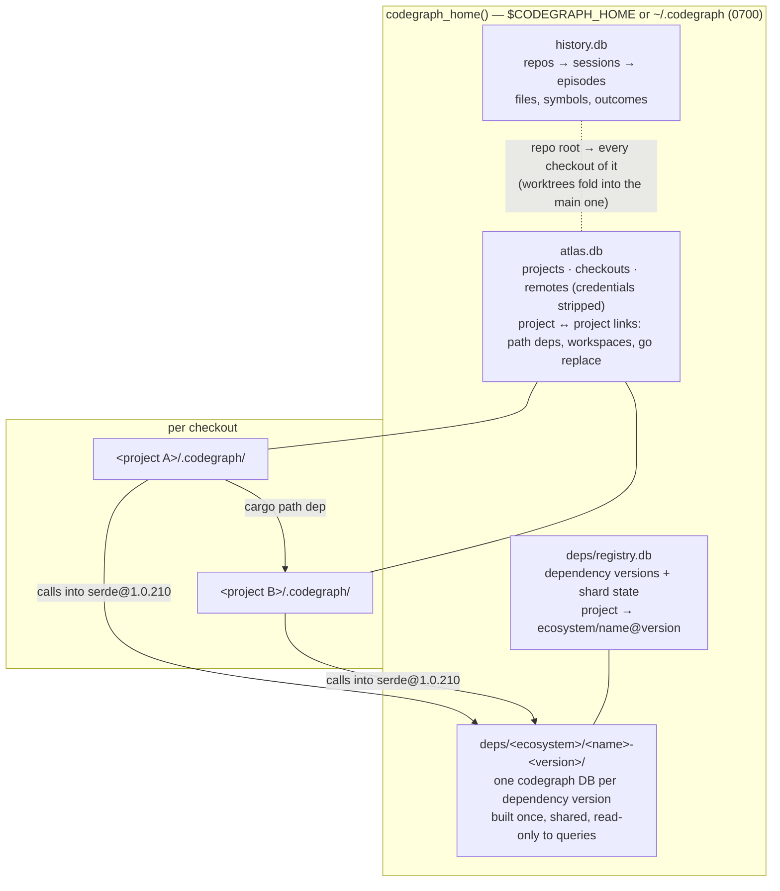

# Federated graph: projects, checkouts and dependencies

One code graph across every project on the machine and the dependencies they
pin — without one monolithic database.

## Why federated, not one global DB

- **Write isolation.** SQLite has one writer per database. Per-checkout
  indexes let every file watcher and `codegraph sync` write independently; a
  single global DB would queue them all behind one lock — the class of stall
  that made the prompt hook time out.
- **Lazy migrations.** A schema or extractor bump upgrades each index on its
  next sync. One database would have to migrate everything (80 GB across 272
  indexes on the development machine) at once.
- **Checkout semantics.** Worktrees and clones of one repo hold different
  code; each checkout keeps its own index (`src/directory.rs` checkout rules).
- **Shared where sharing is real.** Dependency versions *are* identical across
  projects (3,628 crate sources in one cargo registry here), so they are
  indexed once and shared. Cross-project relationships live in a small global
  graph that points at the shards.

## Layout

## Contracts

- `crate::directory::codegraph_home()` / `ensure_codegraph_home()` is the only
  way to find the machine-wide directory.
- A project is identified by its canonical checkout root path; that string
  joins `atlas.db`, `deps/registry.db` and `history.db`.
- Global databases are versioned with `PRAGMA user_version` and idempotent
  migrations, opened WAL with a busy timeout, written in short transactions,
  and opened read-only (creating nothing) on query paths.
- Writes happen on CLI write paths (`init`/`index`/`sync`) or in detached,
  budgeted background processes — never inline in the prompt hook or an MCP
  request.

## Phases

1. **Atlas** (`src/atlas/`, `codegraph projects`) and **dependency store**
   (`src/deps/`, `codegraph deps`): registration, discovery, lockfile parsing,
   source location, shard builds.
2. **Cross-shard resolution**: a project's unresolved references resolve into
   its dependency shards and linked projects' indexes; edges record the target
   shard; dependency signatures type call chains.
3. **Cross-shard queries**: `node`, `callers`, `callees`, `impact`, `explore`
   follow edges into shards; a projects view; "who across my projects calls X".
4. **History join** (done — `src/history/atlas_join/`): session memory
   keyed to atlas projects and followed across their links. See below.

## History join (phase 4)

History and the atlas key a project by a path, but not the same one:
history folds a linked worktree's sessions into the repository's main
checkout (so every session in a repository shares one memory), while the
atlas keeps one row per checkout and groups worktrees by `repo_root`.
`HistoryScope` reconciles them explicitly — an atlas project reads every
history repository recorded at

- its `repo_root` (the main checkout, where history folds worktrees),
- its own `checkout_root`, and
- the `checkout_root` of any other registered checkout of the same
  repository (a worktree history could not fold, e.g. one whose `.git`
  file points at its admin dir by a relative path),

so one history repository maps to every atlas checkout of that repository.
A project nested inside its checkout (an index below the repository root)
narrows to its repo-relative path prefix. Projects outside a repository
have no history.

**Linked projects** are the atlas's code links, either way —
`cargo_path_dep`, Cargo/npm workspace members, npm `file:`/`link:` deps,
go `replace` (a *dependency* when this project names it, a *dependent*
when it names this project) — plus `same_remote` clones.
`nested_workspace` research checkouts and other checkouts of the same
repository are not linked (the latter share its history). For a
dependency the *shared code* is the dependency itself (any session's edits
to its files count); for a dependent it is this project (edits to this
project's files by the dependent's sessions, which history records as
cross-repository touches).

| Surface | What it adds |
|---|---|
| `codegraph projects list` | `lastActivityMs` (latest call, or touch of its files), `sessions30d`; `--sort activity`, `--limit` |
| `codegraph projects show 
` | "Recent agent activity": last 3 episodes, hot files (30d), failures not fixed since (14d); one line per linked project |
| `codegraph history recall --project <name\|path> --related` | the project by atlas name; linked projects' matches, labelled (a path means *this* project's path: a dependent answers with its sessions that touched it) |
| MCP `codegraph_recall` `related: true` | the same groups (`related[]`: `project`, `relation`, episodes/symbols/failures), still ≤ 2 KB — related rows are trimmed before the project's own |
| prompt-hook digest | at most one line (≤ 320 B; block ≤ 1 KB) naming linked projects with open failures or shared-code edits in the last 7 days; skipped — without opening history — when the project has no code links |

**Bounds.** Every store — `history.db`, `atlas.db`, and a project index an
"unchanged since" mark consults — is opened read-only through `atlas::ro`
(`mode=ro`, or `immutable=1` when no writer's `-wal`/`-shm` exist), so no
read creates a file. Queries are indexed and `LIMIT`ed; a deadline
interrupts what outlasts its caller (1 s for the CLI views, 250 ms for
recall, 100 ms for the digest line). On the development machine (342
projects, 190 MB history): `projects list` ~50 ms end to end; the digest
~0.3 ms without code links and ~1–1.3 ms with them (target < 5 ms).
Nothing new is ingested or stored for the join: it reads what `history
ingest` already keeps, under the same privacy rules (repo-relative paths,
masked command templates, error codes).
