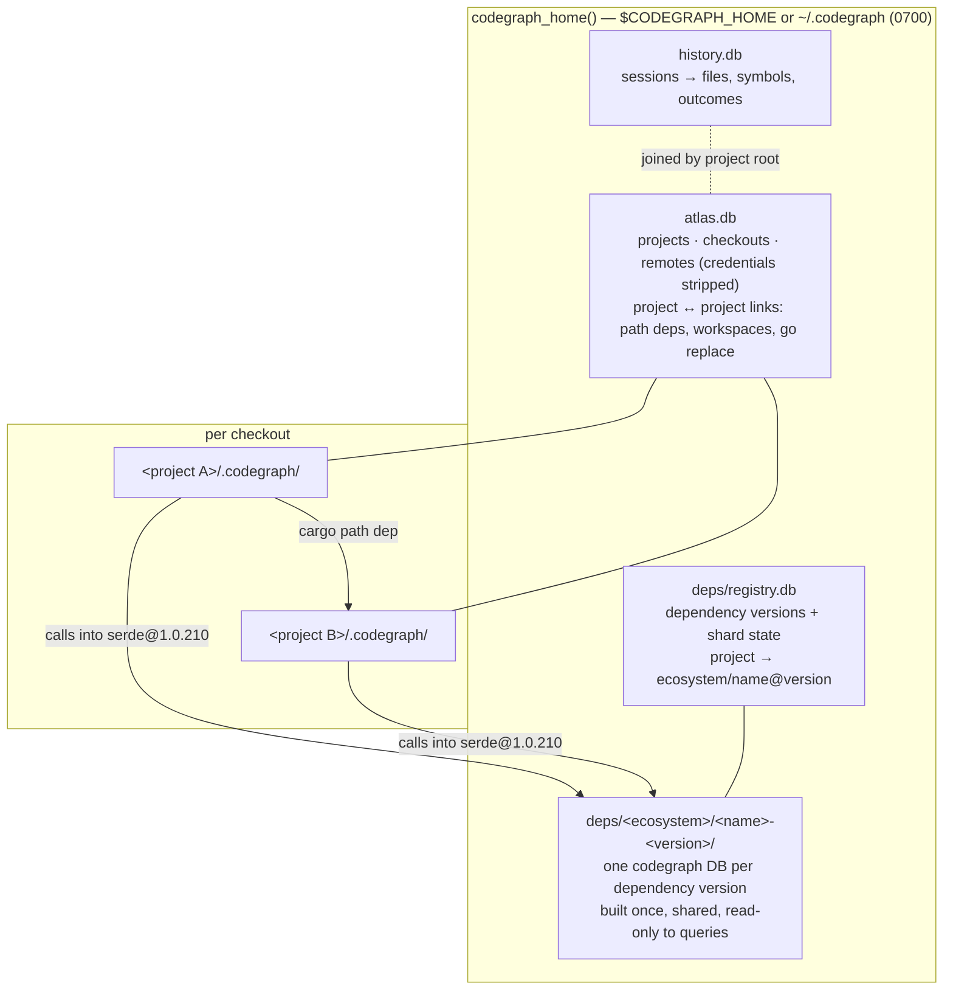

# Federated graph: projects, checkouts and dependencies

One code graph across every project on the machine and the dependencies they
pin — without one monolithic database.

## Why federated, not one global DB

- **Write isolation.** SQLite has one writer per database. Per-checkout
  indexes let every file watcher and `codegraph sync` write independently; a
  single global DB would queue them all behind one lock — the class of stall
  that made the prompt hook time out.
- **Lazy migrations.** A schema or extractor bump upgrades each index on its
  next sync. One database would have to migrate everything (80 GB across 272
  indexes on the development machine) at once.
- **Checkout semantics.** Worktrees and clones of one repo hold different
  code; each checkout keeps its own index (`src/directory.rs` checkout rules).
- **Shared where sharing is real.** Dependency versions *are* identical across
  projects (3,628 crate sources in one cargo registry here), so they are
  indexed once and shared. Cross-project relationships live in a small global
  graph that points at the shards.

## Layout

## Contracts

- `crate::directory::codegraph_home()` / `ensure_codegraph_home()` is the only
  way to find the machine-wide directory.
- A project is identified by its canonical checkout root path; that string
  joins `atlas.db`, `deps/registry.db` and `history.db`.
- Global databases are versioned with `PRAGMA user_version` and idempotent
  migrations, opened WAL with a busy timeout, written in short transactions,
  and opened read-only (creating nothing) on query paths.
- Writes happen on CLI write paths (`init`/`index`/`sync`) or in detached,
  budgeted background processes — never inline in the prompt hook or an MCP
  request.

## Phases

1. **Atlas** (`src/atlas/`, `codegraph projects`) and **dependency store**
   (`src/deps/`, `codegraph deps`): registration, discovery, lockfile parsing,
   source location, shard builds.
2. **Cross-shard resolution**: a project's unresolved references resolve into
   its dependency shards and linked projects' indexes; edges record the target
   shard; dependency signatures type call chains.
3. **Cross-shard queries**: `node`, `callers`, `callees`, `impact`, `explore`
   follow edges into shards; a projects view; "who across my projects calls X".
4. **History join**: session memory keyed to atlas projects; docs and
   research charts updated.
