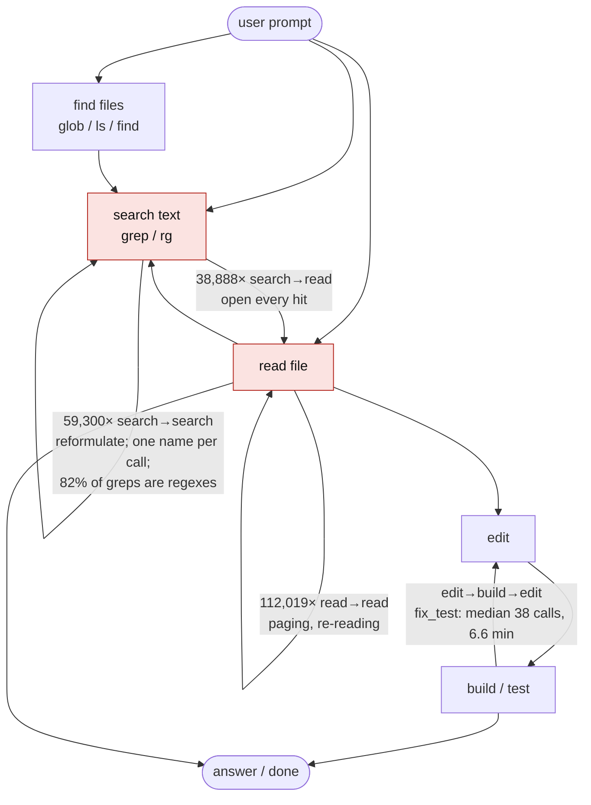
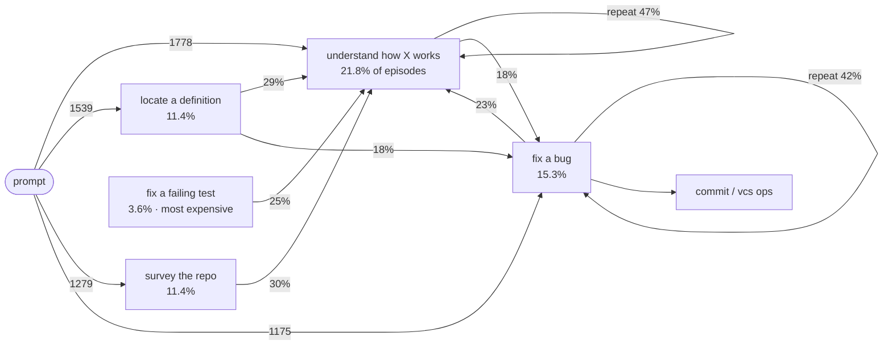
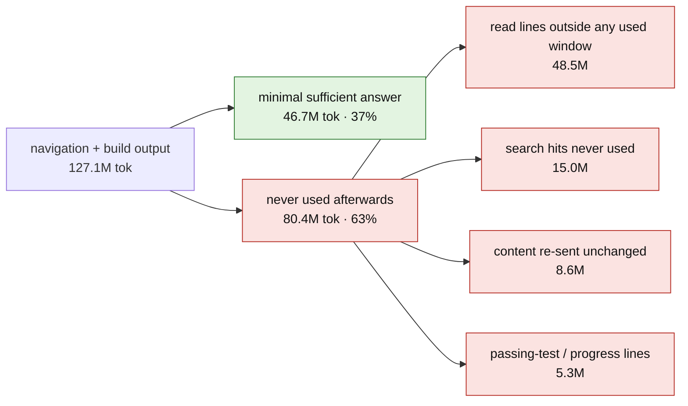
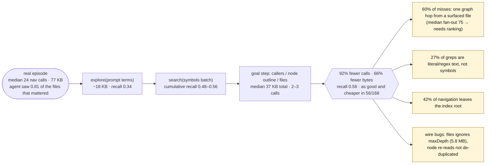
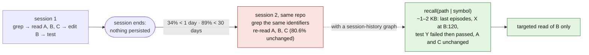
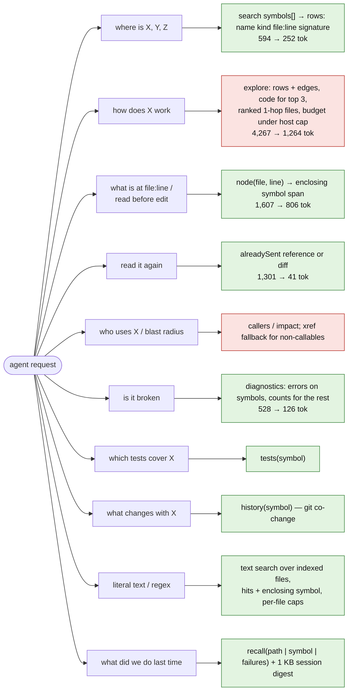
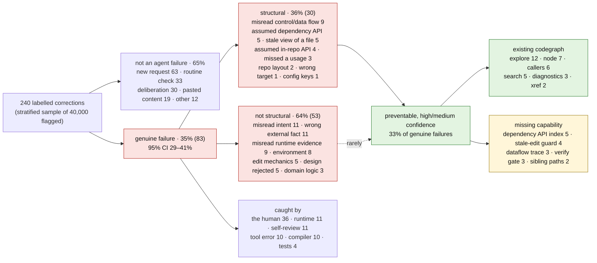

# The patterns agents repeat, and what codegraph should answer instead

Diagrams distilled from 627k–768k mined agent tool calls (opencode, JFC,
Claude Code, prime-agent; 2026-02 → 2026-09). Numbers come from the studies
summarised in [README.md](README.md); every per-goal and per-study chart is in
[`flowcharts/`](flowcharts/) as a standalone `.mmd` file.

## 1. The loop every goal runs

Whatever the prompt asks for, agents run the same navigation loop before they
edit. The three self-loops are where calls and tokens go.

| what the loop costs | measured |
|---|---|
| lines of a read the agent ever uses | **12%** (whole-file reads: 37% of bytes near anything used) |
| search hits the agent ever uses | **39%** (10% strictly); >100-hit searches are half of all search tokens at 28% use |
| read bytes re-sent unchanged in the same session | **8.5%** (median 4 calls after the first send) |
| build/test output that is signal | **16–20%** (passing runs: 11%) |
| calls that are verbatim repeats in the same session | 28.7% overall, falling to 2.6–7% by 2026-09 with newer models |

## 2. How goals chain inside a session

Navigation goals feed the fix loop; `fix_bug` re-enters itself 42% of the time.
(Top transitions only; full chart: `flowcharts/workflows/FLOWCHART_OVERVIEW.mmd`.)

## 3. Where the tokens go

Of 127M tokens of navigation and build output (228k calls with outputs),
**37% was sufficient**; the rest was never observably used.

## 4. The same episodes, answered by codegraph

168 real episodes replayed against today's indexes. A rule-built 2–3 call
codegraph path is far cheaper but finds fewer of the files that mattered.

Per goal (median): symbol lookup 20 calls/70 KB → 2/37 KB; how-it-works 24/88 →
2/38; change impact 24/74 → 3/38; grep alternation 23/68 → 2/38; file paging
30/80 → 3/39; structure survey 26/145 → 2/23. One explore with *perfect* terms
still reaches only 0.49 recall — the single-call file budget, not query
wording, is the ceiling.

## 5. Across sessions, agents start from zero

In git repos, **45%** of the files a session touches were already explored by
an earlier session in the same repo; **59.6%** of read bytes go to such files
and **80.6%** of those files had not changed since. 46% of searches repeat an
identifier an earlier session already searched. 89% of repeats fall within 30
days.

Estimated saving from a "we've been here before" memory: 11 / **57** / 191 M
tokens (low / mid / high) of ~723 M tokens of tool output.

## 6. Target: each recurring request → its minimal answer

What each request kind should return, and where codegraph stands.
Green = shipped on `feat/compiler-diagnostics`, red = gap.

## 7. Where agents go wrong

240 labelled corrections, sampled from 40,000 the corpus flags as a correction,
reversal, recheck or "that's wrong". Only a third are genuine agent failures,
and only a third of *those* are structural — the part a code graph can reach.
The build logs agree: of 38,303 build results, 1,792 failed on a symbol that
does not exist (top codes E0425, E0599, E0432, E0433, TS2339 — names, methods,
imports and paths the agent assumed), and 528 of 45,668 edits failed because
the file had changed under the agent.

## Per-goal and per-study charts

| study | charts |
|---|---|
| workflows (per-goal state machines) | `flowcharts/workflows/FLOWCHART_<goal>.mmd` — understand_code, fix_bug, survey_repo, locate_def, debug_runtime, vcs_ops, implement_feature, fix_compile, fix_test, refactor, impact_analysis, trace_flow, plus `FLOWCHART_OVERVIEW.mmd` |
| consumption (tool output → used → wasted) | `flowcharts/consumption/FLOWCHART_{OVERVIEW,SEARCH,READ,CODEGRAPH,BUILD,MINIMAL}.mmd` |
| replay (agent path vs codegraph path) | `flowcharts/replay/FLOWCHART_{SYMBOL_LOOKUP,HOW_WORKS,CHANGE_IMPACT,GREP_ALTERNATION,FILE_PAGING,STRUCTURE_SURVEY}.mmd` |
| failures (root causes → preventing capability) | `flowcharts/failures/FLOWCHART_FAILURES.mmd` |
| timeline (over time, across sessions, recall design) | `flowcharts/timeline/FLOWCHART_{TIMELINE,REDISCOVERY,SCHEMA,INGEST_QUERY}.mmd` |
