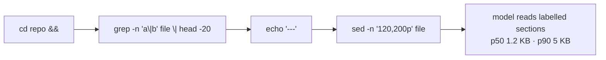
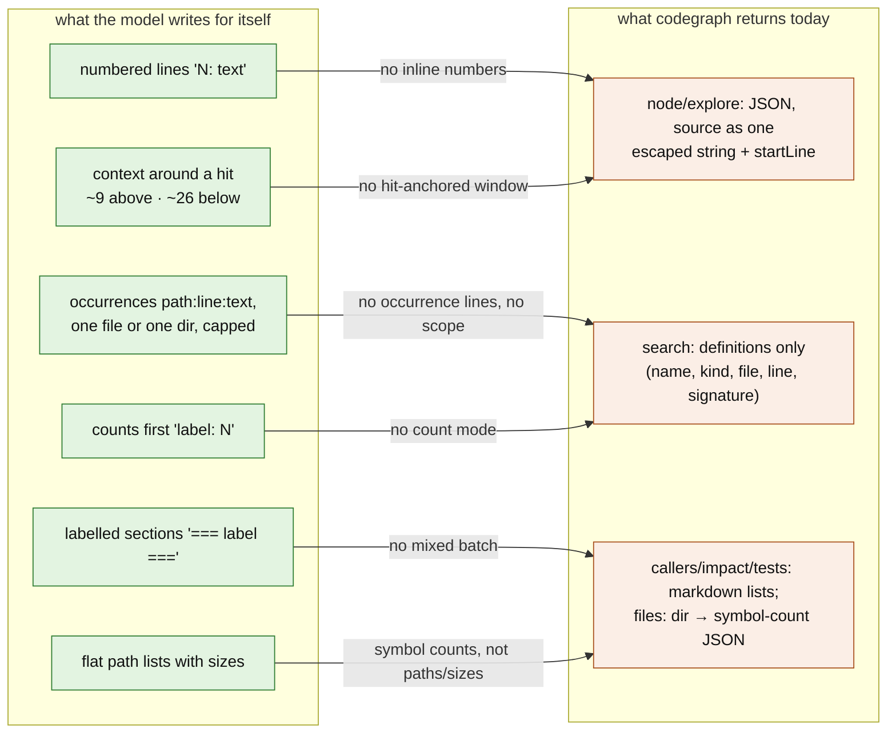
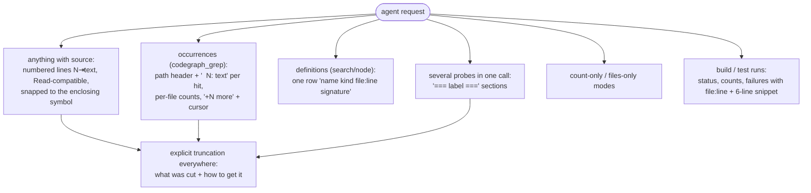

# Formats: what agents write, what they get back, what they build for themselves

Measured over the 627k mined tool calls (263,702 parsed shell commands plus the
structured grep/glob/read tools; outputs from Claude Code, prime-agent and a
2,500-session opencode sample), and compared with what codegraph returns today
(captured from live MCP calls on this repo at `fac1976`). Charts for each
family are in [`flowcharts/formats/`](flowcharts/formats/).

## 1. The commands agents write

**Search is the biggest family** (27.8% of shell commands, plus 43k structured
grep calls): grep 58.8%, the opencode grep tool 31.1%, rg 9.8%; ast-grep is
essentially unused (24 calls).

| what they write | share |
|---|---|
| `grep -n …` as the flags (then `-rn` 8%, `--include=*.ext -rn` 6%) | 37% of greps |
| `rg -n …` | 45% of rg calls |
| pattern is an **alternation** (`a\|b\|c`), usually 2–4 alternatives | 59% |
| pattern is symbol-shaped (identifier, identifier alternation, `fn name` hunt) | 56% |
| pattern is text: literal, phrase, regex, co-occurrence `A.*B` | ~27% |
| search scoped to **one file** / one directory | 58.6% / 20.7% |
| piped to `\| head -N` (N = 20, 10, 30, 40, 5) | 58.6% |

- **Reads**: the harness Read tool (offset+limit 56%, whole file 31%), then
  `sed -n 'a,bp'` (20,159 calls), `cat`, `wc -l` size probes. `sed` windows
  are *guessed*: 62.6% start on a line ending in 0 or 1 and 57.8% are round
  multiples of 10.
- **Finds**: `ls` 45.8% (`-la` 40%), `find` 27.7% (`-name '*.ext'`, `-type f`,
  `-maxdepth 1–3`), glob tool 24.3%; tree and fd are unused.
- **Builds**: `cargo test` 35.5%, check 12.1%, clippy 10.4%; `2>&1` on 56%,
  then `| tail -N` (21%) or `| grep error | head`.
- **One command, many probes**: 40.5% of commands chain 2+ statements (Claude
  Code 70.8%); 42% of those start `cd X &&`, 30% put `echo '=== label ==='`
  between sections, 8.8% run 2+ greps, 6.8% pair a grep with a `sed -n` window.
  The canonical hand-built macro:

Models differ: Claude-family models build these labelled compound macros;
GPT-5.5 sends single wide alternations (36% have 9+ alternatives) with no
`head`; haiku and sonnet sit between.

## 2. What comes back

| family | dominant output shapes | size p50 → p90 |
|---|---|---|
| search | grouped `path` + `  N: text` (24%), sections from compound commands (27%), `line:text` in one file (13.9%), `path:line:text` (6.7%), **empty (12.2%)** | 11 → 108 lines |
| read | numbered `N: text` / `N<TAB>text` (~70%), **raw unnumbered lines (27.4%)** from `sed`/`cat` | 95 → 402 lines |
| find | bare names, path lists, `Found N files`, `ls -l` | ~10–13 entries |
| build | unfiltered p90 144 lines, p99 896 | filtered p50 6 lines |

- **Truncation is silent.** 29.9% of head-limited searches (52.6% of finds)
  fill the limit, and nothing says so; re-running with a bigger N is rare
  (2.5% of re-requests). Agents just try another pattern.
- **A real footgun**: in rg, `\|` is a literal pipe. 128 of 161 such searches
  (79%) came back empty, against 12% overall.
- **After a grep hit, the read window** contains the hit 75.9% of the time,
  starting a median **9 lines above** and ending **26 below** (window p50 80
  lines, p90 231); 18% start exactly on the hit.
- **Search re-requests within 3 calls** (13.7%): pattern partly changed 33.5%,
  identical re-run 19.9%, narrowed 15%, same pattern new scope 10.6%.

## 3. The formats models invent for themselves

When agents write their own navigation code — 45,575 prime-agent Python cells
and 12,364 `python3 -c`/heredoc programs inside bash — what they print shows
the shape they actually want back:

| self-authored shape | how often |
|---|---|
| **numbered lines** `f"{n}: {text}"` (`{n:4}:`, `{n:5d}:`) | the #1 f-string skeleton |
| `=== label ===` / `--- label ---` section headers | ~25% of constant strings; 10.1% of navigation cells |
| `label: {count}` count lines | 2nd–4th most common skeletons |
| character windows `print(text[a:b])` around a needle | 26.7% of navigation cells |
| shell passthrough `print(h.output)` | 22.8% |
| JSON dumps / `file:line` lists | 0.4% / 0.1% — rare |

Helpers they write repeatedly: a numbered-window reader (`lines(path, a, b)`),
grep-with-context-and-dedupe (`ctx=3`, stop at `limit`), a `sh()`/`shr()`
shell wrapper printing labelled sections, an `rg -l` fan-out printing
`{pattern}: {n} files`, size tables (`{nlines:>6}  {path}`). Default budgets
they pick: `limit=200/100/30`, `before=200`, `after=400`, `context=3`.

## 4. What codegraph returns today

Captured live (`codegraph serve --mcp`, this repo):

| tool | format | example size |
|---|---|---|
| search | JSON v2 rows `{name, kind, file, line, endLine, signature}` | 508 B (1 hit) · 3,968 B (3-name batch) |
| node (symbol) | JSON v2 match + callers/callees rows | 1,383 B |
| node (file window, first / repeat) | JSON v2 `{path, startLine, endLine, source}` / `alreadySent` | 1,512 B / 393 B |
| node (outline) | JSON v2 symbol rows | 2,079 B |
| explore | JSON v2: `sourceFiles[].chunks[].source` + relationships | 20,676 B |
| files | JSON v2 dirs → `{file: symbolCount}` | 194 B |
| status, history | JSON | 838 B, 482 B |
| callers, callees, impact, tests | markdown `- name (kind) - file:line` | 102 B – 2.7 KB |

Mismatches, in order of evidence:

1. **No inline line numbers.** Every harness read tool numbers lines and the
   models' own code does too; codegraph's `node`/`explore` put source in one
   JSON-escaped string with a `startLine`. The server instructions still
   promise explore gives "the same `<n>\t<line>` shape `Read` gives you, safe
   to `Edit` from" — it doesn't on the wire. Edits take 90% of their anchor
   text from plain reads and 3.2% from codegraph.
2. **Search finds definitions, agents grep for occurrences** — the matching
   line text, scoped to a file, directory or `--include` glob.
   (`codegraph_grep` is being built for this.)
3. **No hit-anchored window.** Agents want `[hit−9, hit+26]` or the enclosing
   symbol, not a guessed round range.
4. **No count-only / files-only modes, no mixed batch with labelled sections.**
5. **Truncation must be explicit** — codegraph does flag it (`truncated`,
   `nextCursor`, omission counts), which is already better than `| head`.
6. **No test-run digest**, though `cargo test` is 36% of build calls and
   agents `| tail -20` it.
7. **Two formats across tools** (JSON for some, markdown for others).

## 5. The format codegraph should speak

Derived from sections 1–4: match the shapes agents already rebuild by hand.

- Keep machine-readable structure in `structuredContent`, but make the text
  the model reads look like what it already writes for itself: numbered source
  lines, `=== label ===` sections, counts first, `path:line: text` hits.
- Default windows: enclosing symbol, else `[hit−9, hit+26]`.
- Accept both `a\|b` and `a|b` alternation.
- One format family across tools.
